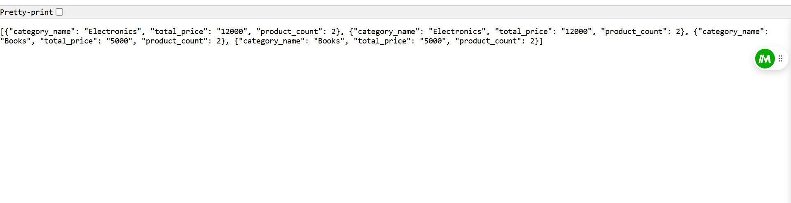

# 1. Queue Using Two Stacks

This project demonstrates how to implement a **Queue** using two **Stacks**, leveraging the LIFO (Last In First Out) nature of stacks to emulate the FIFO (First In First Out) behavior of a queue.

## Explanation
A **Queue** follows the **FIFO** principle, where elements are dequeued in the order they are enqueued. By using two stacks, we can achieve this behavior:

### Two Stacks:
- `stack1`: Used for enqueue operations (adding elements to the queue).
- `stack2`: Used for dequeue operations (removing elements from the queue).

### Operations:
1. **Enqueue (Push into `stack1`):**
   - Add elements to `stack1`. This keeps track of the order in which elements arrive.

2. **Dequeue (Pop from `stack2`):**
   - If `stack2` is empty:
     - Reverse `stack1` into `stack2` (pop all elements from `stack1` and push them to `stack2`).
   - Pop the top element from `stack2`.

This ensures that the oldest element in `stack1` is dequeued first.

### Diagram
Below is a visual representation of the process:

#### Initial State:
- `stack1`: [1, 2, 3]  
- `stack2`: []

#### Reverse `stack1` into `stack2` (before dequeue):
- `stack1`: []  
- `stack2`: [3, 2, 1]

#### Dequeue:
- Pop from `stack2`: [3, 2] (Dequeued element: 1)

# 2. Django Model Query

run the project

1. Open a terminal and enter the Django shell:

   ```bash
   python manage.py shell
   ```
   shell:
   ```python
   from app_name.models import Category, Product
   
   # Create categories
   electronics = Category.objects.create(name="Electronics")
   books = Category.objects.create(name="Books")
   
   # Add products for Electronics
   for _ in range(10):  # 10 products
       Product.objects.create(title="Electronic Product", price=1200.05, category=electronics)
   
   # Add products for Books
   for _ in range(20):  # 20 products
       Product.objects.create(title="Book", price=425.00, category=books)
   ```
   ```
   exit()
   ```
   shell stops
   ```bash
   python manage.py runserver
   ```
   Output Sample:
   
# 3. Signature App
This Django web application allows users to upload two images of signatures and compares the text extracted from them using Tesseract OCR. The application checks if the extracted texts match, indicating whether the signatures are identical.

[Link to the repository](https://github.com/S18-Niloy/SignatureApp)
